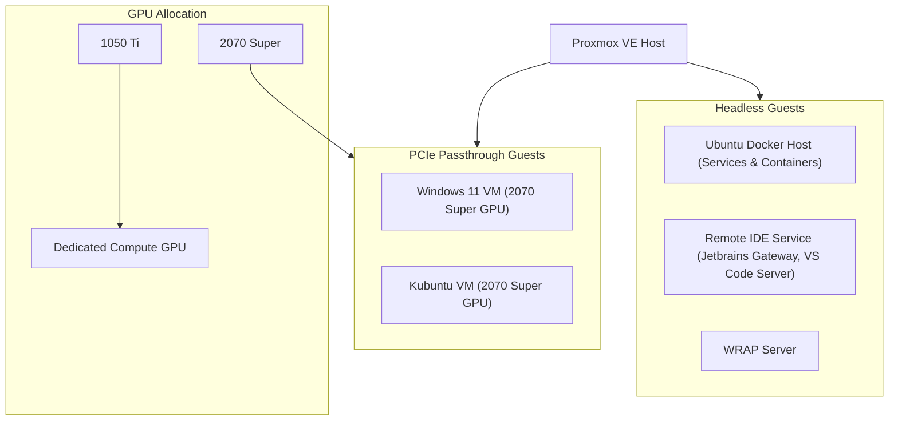
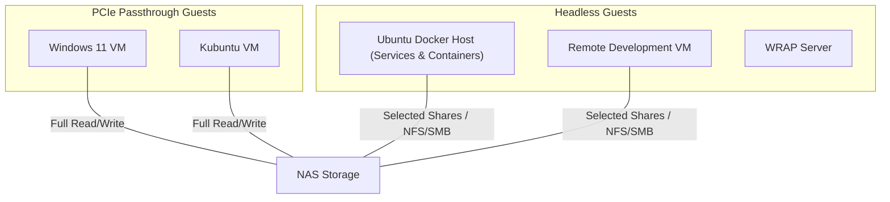

# Proxmox Homelab


## Proxmox Server Stack Architecture



## Proxmox Storage Access Diagram



## Infrastructure Roadmap

```mermaid
timeline
    title Proxmox Server Stack Roadmap

    Baseline Setup : Proxmox VE host with PCIe passthrough guests (Windows 11, Kubuntu) and headless guests (Docker Host, Remote Dev VM, ETC...)
    Monitoring Layer : Add Prometheus + Grafana for metrics and basic alerting
    Planned NAS Storage : Deploy NAS appliance for shared storage access across VMs and containers
    Infrastructure as Code : Use Terraform to declaratively define VMs in Proxmox
    Container Orchestration : Optionally deploy Kubernetes cluster for container orchestration
    Expansion / Experiments : GPU-accelerated workloads on 1050 Ti, ML/AI experiments, optional Ceph/ZFS, improve security/backups
